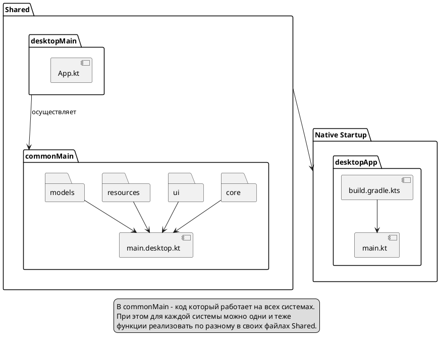

### Multimark - редактор markdown

---

[comment]: <> (Необходимо обновлять по степени изменения во время разработки)

**Структура проекта**

```plantuml
@startuml
package "Native Startup"{
   folder desktopApp{
      [build.gradle.kts] --> [main.kt]
   }
}
folder "Shared"{
   folder commonMain { 
     [main.desktop.kt]
     folder core
     folder ui
     folder resources
     folder models
     
     core --> [main.desktop.kt]
     ui --> [main.desktop.kt]
     resources --> [main.desktop.kt]
     models --> [main.desktop.kt]
   }
   folder desktopMain{
     [App.kt]
   }
   desktopMain --> commonMain :  осуществляет
}

Shared --> "Native Startup"

legend
В commonMain - код который работает на всех системах. 
При этом для каждой системы можно одни и теже 
функции реализовать по разному в своих файлах Shared.
end legend
@enduml
```

**Дорожная карта**

