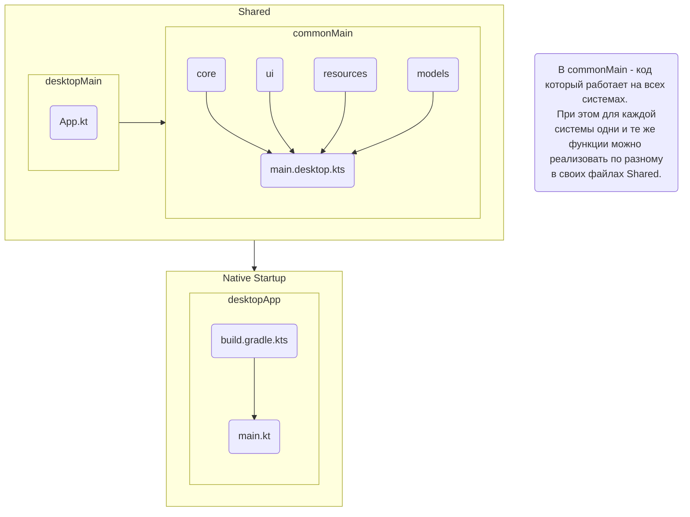

# Multimark

**Multimark** — особенный редактор Markdown, находящийся в разработке. Он предлагает полную поддержку различных
тегов из CommonMark, а также расширения от GitHub и других сервисов. При этом он не ограничивается
только ими, вы сможете добавить собственные теги и реализации с помощью встроенной конфигурации.

Редактор пишется с помощью `Compose Multiplatform + Kotlin`. Это позволяет использовать один и тот
же код для разнообразных платформ, сейчас он разрабатывается в первую очередь как настольное
приложение.

Скрафчен с :heart: в `Leftbrained`!

[comment]: <> (Необходимо обновлять по степени изменения во время разработки)

## Структура проекта

> Обновляется по мере разработки

## Дорожная карта

## Контрибьютинг

Последовательность действий и правила представлены в [CONTRIBUTING](CONTRIBUTING.md)

## User Flow

